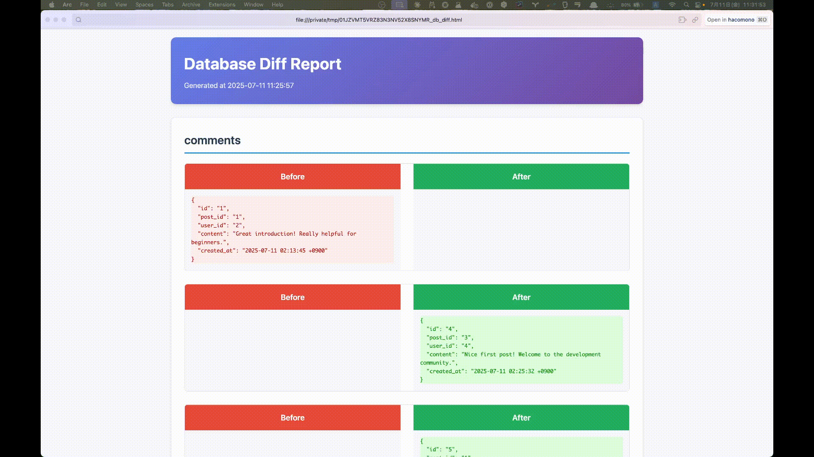

# DB Before After

A Ruby gem that visualizes database changes before and after executing a use case. It generates HTML diff reports showing exactly what changed in your MySQL database.

## Features

- 📊 **Visual Diff Reports**: Side-by-side HTML comparison of database changes
- 🎯 **Smart Detection**: Automatically detects added, deleted, and modified records
- 🔍 **All Tables**: Scans all tables in your database for changes
- 📋 **Clipboard Integration**: Automatically copies output file path to clipboard (macOS)
- 🏷️ **Unique Output**: Uses ULID for unique file naming
- 🌙 **Dark Mode**: Automatic dark mode support based on system preferences
- 🔧 **Extensible**: Adapter pattern for database engines and output formats

## Installation

### Using specific_install

```bash
gem install specific_install
gem specific_install -l https://github.com/iwazzer/db_before_after
```

### Using Bundler

Add this line to your application's Gemfile:

```ruby
gem 'db_before_after', git: 'https://github.com/iwazzer/db_before_after'
```

And then execute:

```bash
bundle install
```

## Usage

### Basic Usage

```bash
db_diff -u <username> -p <password> -d <database>
```

### Full Options

```bash
db_diff [options]
  -h, --host HOST          Database host (default: 127.0.0.1)
  -P, --port PORT          Database port (default: 3306)
  -u, --username USERNAME  Database username (required)
  -p, --password PASSWORD  Database password (required)
  -d, --database DATABASE  Database name (required)
  -e, --encoding ENCODING  Database encoding (default: utf8)
  -s, --suffix SUFFIX      Output file suffix (default: db_diff)
```

### Environment Variables

You can also set database connection parameters via environment variables:

```bash
export DB_HOST=localhost
export DB_PORT=3306
export DB_USERNAME=myuser
export DB_PASSWORD=mypassword
export DB_DATABASE=mydatabase
export DB_ENCODING=utf8
```

### Example Workflow

1. **Start the tool**:
   ```bash
   db_diff -u myuser -p mypassword -d mydatabase
   ```

2. **Wait for first snapshot**:
   ```
   now reading db...
   run usecase now. then press any key when done.
   ```

3. **Execute your use case** (run your application, make API calls, etc.)

4. **Press any key to continue**

5. **View the results**:
   ```
   now reading db...
   output: /tmp/01HG9TSFDH83E4YTZQX0PVJ5Q8_db_diff.html (Copied to clipboard)
   ```

6. **Open the HTML file** (path is already copied to clipboard):
   ```bash
   # Just paste the clipboard content
   open /tmp/01HG9TSFDH83E4YTZQX0PVJ5Q8_db_diff.html
   ```

## Example Output

Here's what the generated HTML diff report looks like:



The tool generates a comprehensive HTML report that shows:

- **Side-by-side comparison** of database changes
- **Clear visual indicators** for additions, deletions, and modifications
- **Dark mode support** that automatically adapts to system preferences
- **JSON-formatted data** for easy reading and analysis

## Output Format

The tool generates an HTML file with:

- **Side-by-side diff view** showing before and after states
- **Color-coded changes**: Green for additions, red for deletions
- **JSON formatted records** for easy reading
- **Table-by-table organization**
- **Automatic handling** of different data types including binary data (MD5 hash)

## Requirements

- Ruby >= 2.7.5
- MySQL database
- Dependencies: `diffy`, `ulid`, `mysql2`, `clipboard`

## Development

After checking out the repo, run:

```bash
bin/setup
```

To install dependencies. Then, run:

```bash
rake spec
```

To run the tests. You can also run:

```bash
bin/console
```

For an interactive prompt that will allow you to experiment.

### Running Tests

```bash
# Run all tests
bundle exec rspec

# Run with documentation format
bundle exec rspec --format documentation

# Run specific test file
bundle exec rspec spec/db_before_after/db_diff_spec.rb
```

## Contributing

Bug reports and pull requests are welcome on GitHub at https://github.com/iwazzer/db_before_after.

## License

The gem is available as open source under the terms of the [MIT License](https://opensource.org/licenses/MIT).

## Changelog

### 0.1.0 (Current)

- Initial release with comprehensive features
- MySQL database support with adapter pattern
- HTML diff report generation with dark mode support
- Database and output adapter architecture for extensibility
- Clipboard integration for easy file access (macOS)
- ULID-based unique file naming
- Comprehensive test suite with 74 tests covering all functionality